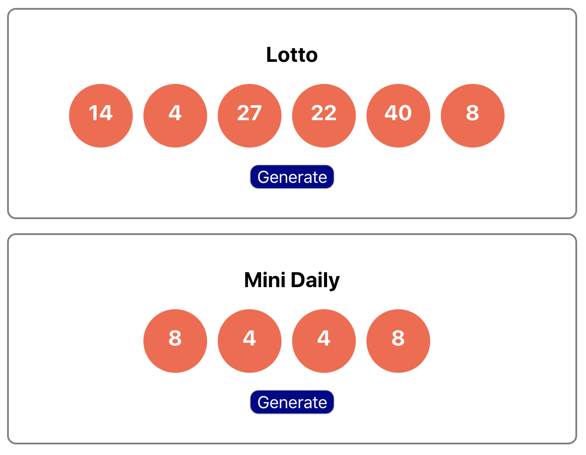

This project was bootstrapped with [Create React App](https://github.com/facebook/create-react-app).

## Lottery!

## Stateful Parent and Downward Data Flow

In the project directory, you will find the following components:

## Lottery Component
This component will be the stateful parent, and will contain the following Props:
- Title of a specific lottery
- Number of balls that will be used to play this lottery
- Max Value boundary for the balls

## Lottery Ball Component
This will be the 'dumb' child component that uses the parent component
The Props that will be used:
- The number of the ball itself is the only prop required
